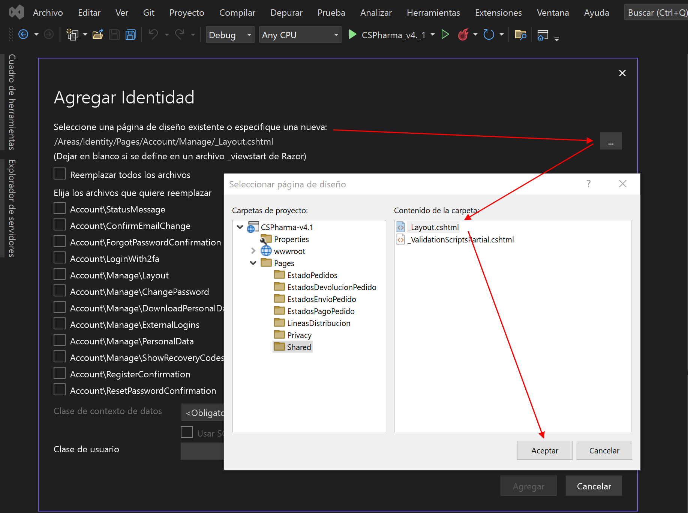
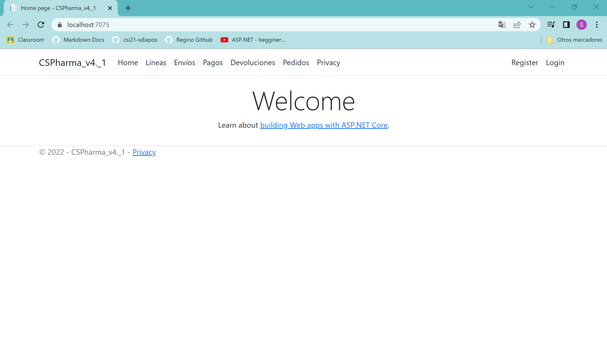
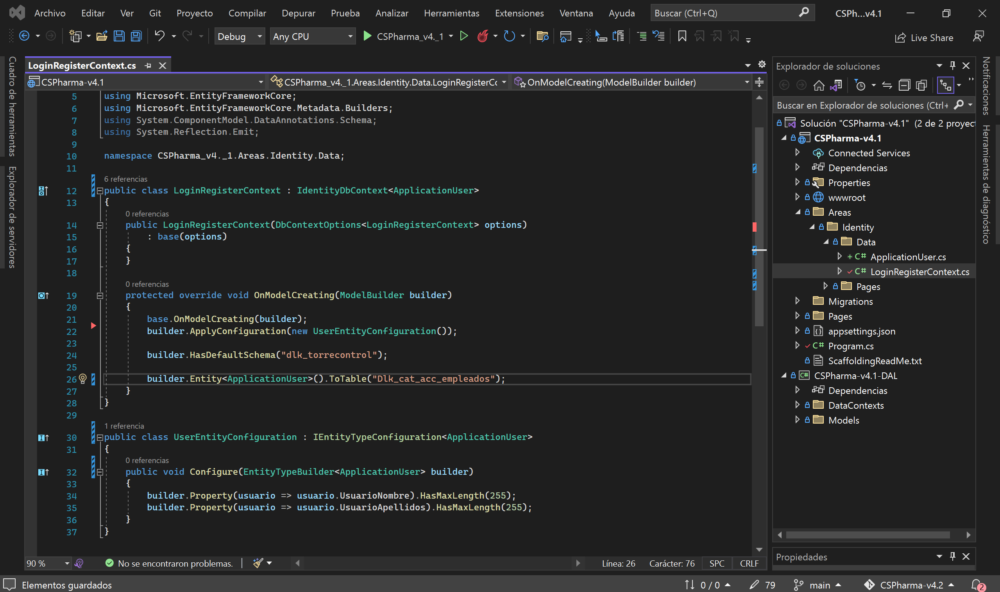
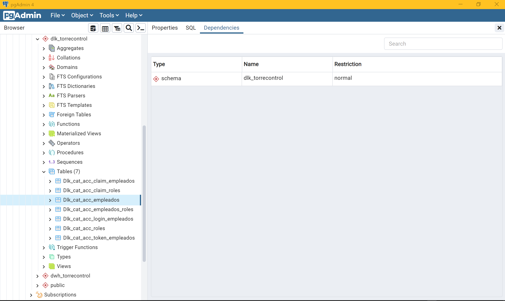
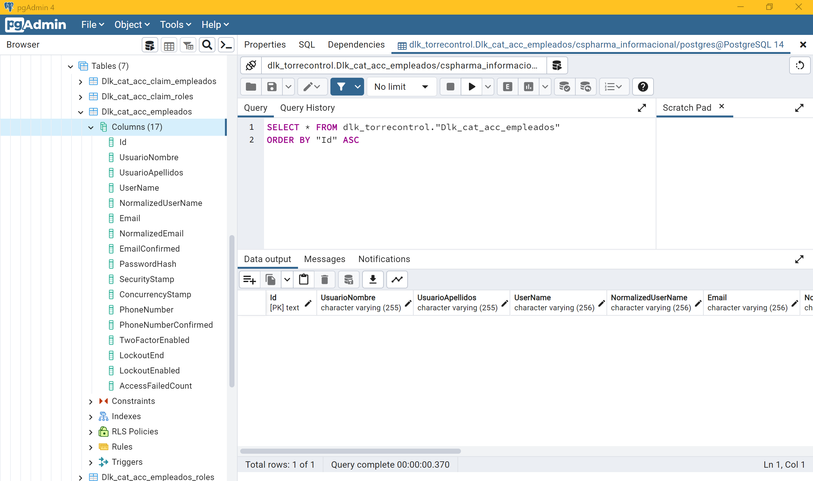

# CSPharma-v4.2.0

- [CSPharma-v4.2.0](#cspharma-v420)
  - [Introducción](#introducción)
- [1. Agregar la identidad del Login y el Register con Scaffold](#1-agregar-la-identidad-del-login-y-el-register-con-scaffold)
    - [*UserAuthenticaion.cs* (actualmente como *ApplicationUser.cs*)](#userauthenticaioncs-actualmente-como-applicationusercs)
- [2. Añadir el botón de Login en el *\_Layout.cshtml* (enrutar nuevo componente)](#2-añadir-el-botón-de-login-en-el-_layoutcshtml-enrutar-nuevo-componente)
  - [*\_Layout.cshtml*](#_layoutcshtml)
- [3. Añadir los campos de UsuarioNombre y UsuarioApellidos](#3-añadir-los-campos-de-usuarionombre-y-usuarioapellidos)
  - [3.1. UserAuthentication.cs](#31-userauthenticationcs)
  - [3.2. LoginRegisterContext.cs](#32-loginregistercontextcs)
- [3.3. Hacemos una migración con el nuevo contexto](#33-hacemos-una-migración-con-el-nuevo-contexto)
- [Observaciones 1](#observaciones-1)
  - [3.4. Register.cshtml.cs](#34-registercshtmlcs)
  - [3.5. Register.cshtml](#35-registercshtml)
  - [3.6. Register.cshtml.cs --\> OnPostAsync()](#36-registercshtmlcs----onpostasync)
  - [3.7. Prueba de registro de usuario](#37-prueba-de-registro-de-usuario)
- [Actualizaciones del proyecto](#actualizaciones-del-proyecto)
  - [Re-Migration - Cambiando los nombres por defecto de las tablas de Scaffold-Identity](#re-migration---cambiando-los-nombres-por-defecto-de-las-tablas-de-scaffold-identity)

## Introducción

En esta nueva versión de CSPharma, vamos a desarrollar un login y un register. Para ello, empezaremos tomando como base lo que Scaffold puede autogenerarnos por nosotros, y para ello, lo primero que tenemos que hacer es instalar el paquete NuGet de *Microsoft.VisualStudio.Web.CodeGeneration.Design*.


**Nota**: a día de hoy, 12/11/2022, la versión 7.0.0 de este paquete NO es compatible con ASP.NET Core 6, de modo que instalaremos mejor la versión 6.0.10, lo que significa que tendremos que instalar las versiones anteriores de la v6.0.10 para el resto de nuestros paquetes, o al menos la más próxima a ésta... en el caso del core de Postgres (Ngpsql) no existe la v6.0.10 pero podemos instalar su v6.0.7

# 1. Agregar la identidad del Login y el Register con Scaffold

Hacemos click derecho sobre el (csproj) proyecto principal (porque parece ser que sobre la capa DAL no aparece la opción de Scaffold), y le damos a *agregar nuevo elemento con Scaffold*, y a su vez, le damos a Identity.


Una vez que entramos en el cuadro de dialogo del selector de opciones de Identity, lo primero es decirle cual es nuestro *_Layout.cshtml*.



Lo siguiente será seleccionar (marcando) aquellas características de nuestro login/register que queramos que Scaffold cree por nosotros. Como en esta versión, estamos tomando contacto con esta nueva funcionalidad de Scaffold, para comenzar haciéndolo sencillo y básicamente funcional, voy a elegir tan sólo por ahora el Login, Logout y Register.

Luego nos encontramos con que hay que decirle el nombre del nuevo contexto que Scaffold necesita crear para hacer todo esto.


Por último, tenemos que decirle el nombre de la clase controladora que Scaffold creará para hacer toda la lógica de la autentificación de nuestro programa.


Podemos apreciar que Scaffold nos ha creado un nuevo directorio llamado *Areas* el cual contiene los archivos necesarios para las características que le habíamos pedido que autogenerase.


**Nota**: La clase de *UserAuthentication.cs* la he creado yo mismo manualmente.

**Nota**: La clase de *UserAuthentication.cs* ha sido renombrada actualmente a *ApplicationUser.cs*

### *UserAuthenticaion.cs* (actualmente como *ApplicationUser.cs*)

```csharp
namespace CSPharma_v4._1.Areas.Identity.Data;

// Add profile data for application users by adding properties to the UserAuthentication class
public class ApplicationUser : IdentityUser
{
    // aquí van los nuevos campos que quieras añadir a la tabla de usuarios (empleados)
}
```

# 2. Añadir el botón de Login en el *_Layout.cshtml* (enrutar nuevo componente)

⚠️⚠️⚠️ ATENCIÓN ⚠️⚠️⚠️

Si intentamos el ejecutar el proyecto en estos momentos, nos saltará un error de compilación... en el Program.cs !!

Esto es debido a que Scaffold nos ha colocado un nuevo servicio de conexión hacia SqlServer (lo hace así por defecto) y con el nuevo contexto que él mismo ha creado. Necesitamos cambiar esto para PostgreSQL.


**Nota**: también nos ha definido otro nuevo servicio llamando al *UserAuthentication.cs*


## *_Layout.cshtml*

Tenemos que añadir al final del navbar y antes del cierre de tu tag (```</nav>```) lo siguiente: 
```html
<partial name="_LoginPartial" />
```

```html
<header>
        <nav class="navbar navbar-expand-sm navbar-toggleable-sm navbar-light bg-white border-bottom box-shadow mb-3">
            <div class="container">
                <a class="navbar-brand" asp-area="" asp-page="/Index">CSPharma_v4._1</a>
                <button class="navbar-toggler" type="button" data-bs-toggle="collapse" data-bs-target=".navbar-collapse" aria-controls="navbarSupportedContent"
                        aria-expanded="false" aria-label="Toggle navigation">
                    <span class="navbar-toggler-icon"></span>
                </button>
                <div class="navbar-collapse collapse d-sm-inline-flex justify-content-between">
                    <ul class="navbar-nav flex-grow-1">
                        <li class="nav-item">
                            <a class="nav-link text-dark" asp-area="" asp-page="/Index">Home</a>
                        </li>
                        <li class="nav-item">
                            <a class="nav-link text-dark" asp-area="" asp-page="/LineasDistribucion/Index">Líneas</a>
                        </li>
                        <li class="nav-item">
                            <a class="nav-link text-dark" asp-area="" asp-page="/EstadosEnvioPedido/Index">Envíos</a>
                        </li>
                        <li class="nav-item">
                            <a class="nav-link text-dark" asp-area="" asp-page="/EstadosPagoPedido/Index">Pagos</a>
                        </li>
                        <li class="nav-item">
                            <a class="nav-link text-dark" asp-area="" asp-page="/EstadosDevolucionPedido/Index">Devoluciones</a>
                        </li>
                        <li class="nav-item">
                            <a class="nav-link text-dark" asp-area="" asp-page="/EstadoPedidos/Index">Pedidos</a>
                        </li>
                        <li class="nav-item">
                            <a class="nav-link text-dark" asp-area="" asp-page="/Privacy/Privacy">Privacy</a>
                        </li>
                    </ul>
                </div>

                <partial name="_LoginPartial" />
            </div>
        </nav>
    </header>
```

Si observamos mejor el directorio de *Shared*, nos damos cuenta de que ese archivo llamado *_LoginPartial* se encuentra ahí al lado, porque también nos lo ha autogenerado Scaffold.

Si ahora ejecutamos el proyecto podremos ver los botones de Login y Register en nuestro navbar.



Si pulsamos sobre ellos, podemos ver cómo lucen las vistas autogeneradas por Scaffold 🤩


Pero si nos fijamos bien, normalmente para un Register se le suele pedir al usuario su nombre y apellidos... vamos a ver cómo añadimos estos campos.

# 3. Añadir los campos de UsuarioNombre y UsuarioApellidos

## 3.1. UserAuthentication.cs

```csharp
using System;
using System.Collections.Generic;
using System.Linq;
using System.Threading.Tasks;
using Microsoft.AspNetCore.Identity;

namespace CSPharma_v4._1.Areas.Identity.Data;

// Add profile data for application users by adding properties to the UserAuthentication class
public class UserAuthentication : IdentityUser
{
    public string UsuarioNombre { get; set; }
    public string UsuarioApellidos { get; set; }
}
```

## 3.2. LoginRegisterContext.cs

```csharp
using CSPharma_v4._1.Areas.Identity.Data;
using Microsoft.AspNetCore.Identity;
using Microsoft.AspNetCore.Identity.EntityFrameworkCore;
using Microsoft.CodeAnalysis;
using Microsoft.EntityFrameworkCore;
using Microsoft.EntityFrameworkCore.Metadata.Builders;
using System.ComponentModel.DataAnnotations.Schema;
using System.Reflection.Emit;

namespace CSPharma_v4._1.Areas.Identity.Data;

public class LoginRegisterContext : IdentityDbContext<ApplicationUser>
{
    public LoginRegisterContext(DbContextOptions<LoginRegisterContext> options)
        : base(options)
    {
    }

    protected override void OnModelCreating(ModelBuilder builder)
    {
        base.OnModelCreating(builder);
        builder.ApplyConfiguration(new UserEntityConfiguration());
        builder.HasDefaultSchema("dlk_torrecontrol");

        /*************************** to change the table names ***************************/
        // builder.Entity<IdentityUser>().ToTable("Dlk_cat_acc_empleados"); // esto da error luego
        // https://stackoverflow.com/questions/19460386/how-can-i-change-the-table-names-when-using-asp-net-identity
        builder.Entity<ApplicationUser>().ToTable("Dlk_cat_acc_empleados");
        builder.Entity<IdentityRole>().ToTable("Dlk_cat_acc_roles");

        // Error: Using the generic type 'IdentityUserRole<TKey>' requires 1 type arguments
        // https://stackoverflow.com/questions/54283342/using-the-generic-type-identityuserroletkey-requires-1-type-arguments
        builder.Entity<IdentityUserRole<string>>().ToTable("Dlk_cat_acc_empleados_roles");
        builder.Entity<IdentityRoleClaim<string>>().ToTable("Dlk_cat_acc_claim_roles");
        builder.Entity<IdentityUserClaim<string>>().ToTable("Dlk_cat_acc_claim_empleados");
        builder.Entity<IdentityUserLogin<string>>().ToTable("Dlk_cat_acc_login_empleados");
        builder.Entity<IdentityUserToken<string>>().ToTable("Dlk_cat_acc_token_empleados");
    }
}

public class UserEntityConfiguration : IEntityTypeConfiguration<ApplicationUser>
{
    public void Configure(EntityTypeBuilder<ApplicationUser> builder)
    {
        builder.Property(usuario => usuario.UsuarioNombre).HasMaxLength(255);
        builder.Property(usuario => usuario.UsuarioApellidos).HasMaxLength(255);
    }
}
```

Con `builder.HasDefaultSchema()` podemos añadir un nuevo esquema a la BBDD, en el cual se volcará toda la migración.

Con `builder.Property()` podemos añadir nuevos campos al modelo de usuario que Scaffold tiene por defecto.

Con `builder.Entity<UserAuthentication>().ToTable()` podemos cambiar el nombre de la futura tabla en la BBDD de la clase usuario (modelo) IdentityUser (utilizando nuestro *<UserAuthentication>*, el cual actualmente lo tengo renombrado a *<ApplicationUser>*), la cual pasaría de llamarse "AspNetUsers" a "Dlk_cat_acc_empleados". 

**Nota**: si en la clase de *UserAuthentication.cs*, pulsamos Control y hacemos click sobre la clase padre de *IdentityUser*, podemos ver que el usuario por defecto de Scaffold tendrá los siguientes campos:

```csharp
[PersonalData]
public virtual TKey Id { get; set; }
      
[ProtectedPersonalData]
public virtual string UserName { get; set; }

public virtual string NormalizedUserName { get; set; }
        
[ProtectedPersonalData]
public virtual string Email { get; set; }
    
public virtual string NormalizedEmail { get; set; }
        
[PersonalData]
public virtual bool EmailConfirmed { get; set; }
    
public virtual string PasswordHash { get; set; }
        
public virtual string SecurityStamp { get; set; }
    
public virtual string ConcurrencyStamp { get; set; } = Guid.NewGuid().ToString();
    
[ProtectedPersonalData]
public virtual string PhoneNumber { get; set; }
        
[PersonalData]
public virtual bool PhoneNumberConfirmed { get; set; }
        
[PersonalData]
public virtual bool TwoFactorEnabled { get; set; }
    
public virtual DateTimeOffset? LockoutEnd { get; set; }
    
public virtual bool LockoutEnabled { get; set; }
       
public virtual int AccessFailedCount { get; set; }
```

**Nota**: con las clases internas que Scaffold ha creado, habiendo elegido las características de Login-Logout-Register, cuando hagamos la migración, se nos crearán las siguientes tablas en la BBDD:

| AspNetRoleClaims |
--- |
| Id, RoleId, ClaimType, ClaimValue |

| AspNetRoles |
--- |
| Id, Name, NormalizedName, ConcurrencyStamp |

| AspNetUserClaims |
--- |
| Id, UserId, ClaimType, ClaimValue |

| AspNetUserLogins |
--- |
| LoginProvider, ProviderKey, ProviderDisplayName, UserId |

| AspNetUserRoles |
--- |
| UserId, RoleId |

| AspNetUserTokens |
--- |
| Id, LoginProvider, Name, Value |

| AspNetUsers |
--- |
| Id, UserName, NormalizedUserName, Email, NormalizedEmail, EmailConfirmed, PasswordHash, SecurityStamp, ConcurrencyStamp, PhoneNumber, PhoneNumberConfirmed, TwoFactorEnabled, LockoutEnd, LockoutEnabled, AccessFailedCount |

**Nota**: los nombres de estas tablas son los nombres con los que se crean por defecto, pero si en el contexto hemos especificado otro nombre con el modelBuilder (fluent API), entonces los nombres que encontraremos en las tablas serán efectivamente los que nosotros habíamos definido antes en el contexto.

Esta última tabla de AspNetUsers es la principal, la que Scaffold llama IdentityUser, y en la que nosotros hemos añadido los campos de UsuarioNombre y UsuarioApellidos.

Podríamos cambiar el nombre de las tablas volviendo a hacer uso de Fluent API, es decir, del ModelBuilder en la sobreescritura de su método OnModelCreating().



# 3.3. Hacemos una migración con el nuevo contexto

Y podemos observar en pgAdmin que se han creado las tablas pertinentes en el schema de "dlk_torrecontrol".



# Observaciones 1

Con todo lo hecho hasta ahora, he podido hacer un par de observaciones interesantes y a tener en cuenta. 

Para crear toda esta lógica del acceso y registro del usuario, Scaffold crea su propia arquitectura interna en el proyecto (el directorio de *Areas*), en el cual, a su vez, dentro de la carpeta *Identity*, los archivos se subdividen en *Data* y *Pages*. 

La carpeta *Data* sería el equivalente al *Models* de la capa DAL; y la carpeta *Pages* es como otro Pages pero propio de Scaffold para reunir todo lo perteneciente al tema del Login y el Register (así como cualquier otro módulo con relación a la cuenta del usuario y al acceso de éste en la web). 

Esta arquitectura automática es mejor dejarla como está y no cambiarla, ya que entonces, podríamos incurrir en errores de rutas y refencias.

La nueva migración de CodeFirst que se hace en el proyecto principal, no pisaría la otra migración que hicimos en la capa DAL, ya que son proyectos diferentes (pero referenciados), y cada migración tiene su propio contexto y esquema.

Para cambiar el nombre por defecto con el que se crearía una tabla, se usa ModelBuilder en el contexto en el método de sobreescritura del OnModelCreating().



## 3.4. Register.cshtml.cs

```csharp
public class InputModel
  {
    [Required]
    [StringLength(255, ErrorMessage = "El campo del nombre tiene un máximo de 255 caracteres", MinimumLength = 1)]
    [Display(Name = "UsuarioNombre")]
    public string UsuarioNombre { get; set; }

    [Required]
    [StringLength(255, ErrorMessage = "El campo de los apellidos tiene un máximo de 255 caracteres", MinimumLength = 1)]
    [Display(Name = "UsuarioApellidos")]
  	public string UsuarioApellidos { get; set; }

    /// <summary>
    ///     This API supports the ASP.NET Core Identity default UI infrastructure and is not intended to be used
    ///     directly from your code. This API may change or be removed in future releases.
    /// </summary>
    [Required]
    [EmailAddress]
    [Display(Name = "Email")]
    public string Email { get; set; }

  	/// <summary>
    ///     This API supports the ASP.NET Core Identity default UI infrastructure and is not intended to be used
    ///     directly from your code. This API may change or be removed in future releases.
    /// </summary>
    [Required]
    [StringLength(100, ErrorMessage = "The {0} must be at least {2} and at max {1} characters long.", MinimumLength = 6)]
    [DataType(DataType.Password)]
    [Display(Name = "Password")]
    public string Password { get; set; }

    /// <summary>
    ///     This API supports the ASP.NET Core Identity default UI infrastructure and is not intended to be used
    ///     directly from your code. This API may change or be removed in future releases.
    /// </summary>
    [DataType(DataType.Password)]
    [Display(Name = "Confirm password")]
    [Compare("Password", ErrorMessage = "The password and confirmation password do not match.")]
    public string ConfirmPassword { get; set; }
}
```

## 3.5. Register.cshtml

```html
<form id="registerForm" asp-route-returnUrl="@Model.ReturnUrl" method="post">
            <h2>Create a new account.</h2>
            <hr />
            <div asp-validation-summary="ModelOnly" class="text-danger"></div>
            <div class="form-floating">
                <input asp-for="Input.UsuarioNombre" class="form-control" autocomplete="UsuarioNombre" aria-required="true" />
                <label asp-for="Input.UsuarioNombre"></label>
                <span asp-validation-for="Input.UsuarioNombre" class="text-danger"></span>
            </div>
            <div class="form-floating">
                <input asp-for="Input.UsuarioApellidos" class="form-control" autocomplete="UsuarioApellidos" aria-required="true" />
                <label asp-for="Input.UsuarioApellidos"></label>
                <span asp-validation-for="Input.UsuarioApellidos" class="text-danger"></span>
            </div>
            <div class="form-floating">
                <input asp-for="Input.Email" class="form-control" autocomplete="username" aria-required="true" />
                <label asp-for="Input.Email"></label>
                <span asp-validation-for="Input.Email" class="text-danger"></span>
            </div>
            <div class="form-floating">
                <input asp-for="Input.Password" class="form-control" autocomplete="new-password" aria-required="true" />
                <label asp-for="Input.Password"></label>
                <span asp-validation-for="Input.Password" class="text-danger"></span>
            </div>
            <div class="form-floating">
                <input asp-for="Input.ConfirmPassword" class="form-control" autocomplete="new-password" aria-required="true" />
                <label asp-for="Input.ConfirmPassword"></label>
                <span asp-validation-for="Input.ConfirmPassword" class="text-danger"></span>
            </div>
            <button id="registerSubmit" type="submit" class="w-100 btn btn-lg btn-primary">Register</button>
        </form>
```


**Nota**: también viene ya con algunas condiciones de control de formularios:


## 3.6. Register.cshtml.cs --> OnPostAsync()

Al principio de la comprobación para la validación del ModelState, y justo después de la creación del usuario en la variable user, añadimos el UsuarioNombre y el UsuarioApellidos:

```csharp
var user = CreateUser();

user.UsuarioNombre = Input.UsuarioNombre;
user.UsuarioApellidos = Input.UsuarioApellidos;

await _userStore.SetUserNameAsync(user, Input.Email, CancellationToken.None);
await _emailStore.SetEmailAsync(user, Input.Email, CancellationToken.None);
var result = await _userManager.CreateAsync(user, Input.Password);
```

## 3.7. Prueba de registro de usuario

Si ejecutamos el proyecto y registramos un usuario, se nos redirige a una página temporal de confirmación, normalmente usada para la verificación vía email. Confirmamos y ya podemos acceder como ese usuario, y entonces nos lleva a la página de inicio (home).


**Nota**: podemos deshabilitar la página de confirmación de email, cambiando tal opción desde el *Program.cs*:

```csharp
builder.Services.AddDefaultIdentity<UserAuthentication>(options => options.SignIn.RequireConfirmedAccount = false)
    .AddEntityFrameworkStores<LoginRegisterContext>();
```


Podemos apreciar que Scaffold ha incluído por defecto funcionalidades que nosotros no habíamos elegido (como el reset password) o que nosotros aún no hemos añadido...

Así que vamos a probar a añadir TODAS las características de Scaffold-Identity !! (marcando todas las opciones menos la de Register, porque hemos hecho cambios nosotros mismos en ella)


# Actualizaciones del proyecto

## Re-Migration - Cambiando los nombres por defecto de las tablas de Scaffold-Identity

[prueba de ejecución después de hacer de nuevo la migración y de cambiar los nombres de las tablas](https://github.com/csi21-sdiapos/CSPharma-v4.2/issues/2)